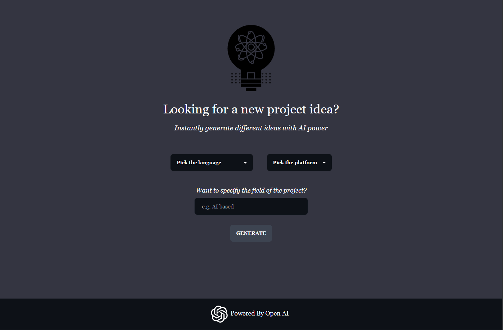

# AI Project Idea Generator

This tool is built using React, Tailwind, and DaisyUI and uses the OpenAI API to generate project ideas based on the presented criteria

<div style="text-align:center">

</div>

## Next up:

- [ ] Add API key by the user option
- [ ] Save API key in the local storage

## Recent Add-ons:

- [x] Copy text button
- [x] Render Platform first and then languages accordingly
- [x] Generate response only when platform and language is selected

## Install dependencies:

```bash
npm install
```

Create a .env file and add your API key to it:

```bash
VITE_OPENAI_API_URL='https://api.openai.com/v1/chat/completions'
VITE_OPENAI_API_KEY='ADD_YOUR_KEY_HERE'
```

## Run the dev server:

```bash
npm run dev
```
